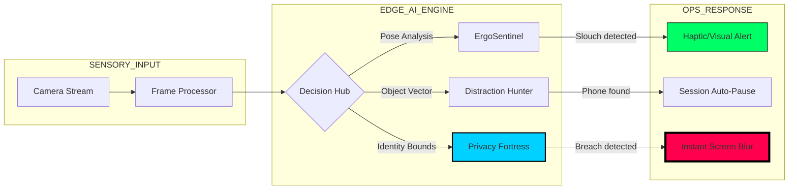

<div align="center">

# 🛡️ SentinelFocus: Deep Work OPS
### **The Ultimate Edge-AI Surveillance & Privacy Fortress**

[](https://github.com/bahattinyunus/SentinelFocus)
[](https://github.com/bahattinyunus/SentinelFocus)
[](https://github.com/bahattinyunus/SentinelFocus)
[](https://github.com/bahattinyunus/SentinelFocus)

**SentinelFocus** is a high-stakes productivity sentinel that transforms your workspace into a secure digital bunker. No cloud, no lag, just elite Edge-AI performance.

[**⚡ LAUNCH CONSOLE**](#) | [**�️ PROTOCOLS**](#-level-4-security-protocols) | [**🏗️ ARCHITECTURE**](#-tactical-architecture)

---

</div>

## 🌌 The Sentinel Mission
In an era of digital surveillance, **Privacy is the only currency**. SentinelFocus guarantees that your vision, your posture, and your focus remain entirely local. Every pixel is processed within the boundaries of your hardware.

---

## 🖥️ Command Center Dashboard

| 🔍 SENSOR FEED | 🛡️ SECURITY STATUS | 📊 OPS METRICS |
| :--- | :--- | :--- |
| **Active Vision Hub** | **Level-4 Privacy Shield** | **Focus Efficiency: 94%** |
| Real-time Pose Detection | Unauthorized Personnel: `NONE` | Active Session: `02:42:15` |
| Object Recognition (Phone) | Kill-Switch: `READY` | Posture Score: `A-Grade` |

---

## ⚡ Tactical Architecture (Logic Map)



---

## 🛡️ Level-4 Security Protocols

> [!IMPORTANT]
> **PROTOCOL 01: THE PRIVACY FORTRESS**
> If a second face or unrecognized movement is detected behind the operator, the system activates an immediate `40px Backdrop Blur` across all sensitive application windows.

> [!WARNING]
> **PROTOCOL 02: DISTRACTION KILL-SWITCH**
> Upon detecting a mobile device (`cell phone`) within the primary focus vector, the session is placed in `STASIS MODE`. All work metrics are frozen until the distraction is neutralized.

---

## �️ Mission Control Setup (Hızlı Kurulum)

```bash
# Clone the Tactical Repo
git clone https://github.com/bahattinyunus/SentinelFocus.git

# Initialize Core Dependencies
npm install --force

# Deploy Sentinel Locally
npm run dev
```

---

## 📈 Roadmap: The Future of Deep Work

| Phase | Milestone | Status |
| :--- | :--- | :--- |
| **I** | **Next.js Core Vision Engine** | `OPERATIONAL` |
| **II** | **Spotify/Distraction Sync** | `IN DEVELOPMENT` |
| **III** | **VS Code Tactical Plug-in** | `PLANNED` |
| **IV** | **Electron Native Desktop Shell** | `Q1 2026` |

---

<div align="center">

### **BECOME THE SENTINEL OF YOUR OWN FOCUS.**
Developed for the elite thinkers who demand zero distractions and absolute privacy.
[Contribute to the Codebase](CONTRIBUTING.md) | [Support the Mission](LICENSE.md)

</div>
