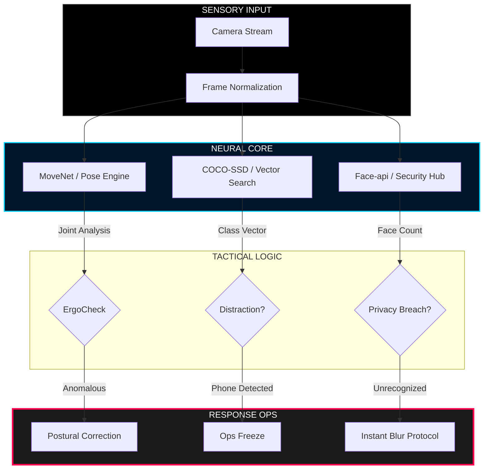

<div align="center">

# 🌌 SENTINEL_FOCUS // DEEP_WORK_FORTRESS
### **[ TERMINAL // LEVEL_4_ACCESS_GRANTED ]**

<br/>


<br/>

**SentinelFocus** is not just a tool; it's a digital guardian. It leverages elite **Edge-AI Vision** to secure your workspace, optimize your posture, and defend your privacy with military-grade precision.

---

[ **⚡ BOOT CONSOLE** ](#-mission-startup) | [ **🛡️ DEFENSE PROTOCOLS** ](#-security-protocols) | [ **🧠 NEURAL MAP** ](#-neural-signal-path) | [ **🛠️ TECH SPECS** ](#-tactical-specifications)

---

</div>

## 🌐 THE SYSTEM MANIFESTO
> "In the vacuum of deep work, focus is the only weapon. Privacy is the only shield." 
> 
> SentinelFocus executes 100% of its neural logic within the boundaries of your local CPU/GPU. **Not a single byte of vision data reaches the cloud.**

---

## 🖥️ OPS COMMAND CENTER

```text
┌──────────────────────────────────────────────────────────┐
│  SENTINEL_DASHBOARD v4.1 // TACTICAL_OVERVIEW            │
├──────────────────────────────────────────────────────────┤
│  [ SCANNER ]  [ ANALYSIS ]  [ SHIELD ]  [ SESSION ]      │
│  ───────────  ────────────  ──────────  ───────────      │
│  LIVE_FEED    60 FPS_SYNC   L4_ACTIVE   02:45:12         │
│  POSTURE_OK   EYE_SYNC_ON   PEOPLE: 0   EFF: 98.4%       │
└──────────────────────────────────────────────────────────┘
```

---

## 🧠 NEURAL SIGNAL PATH


---

## 🔒 SECURITY PROTOCOLS

> [!CAUTION]
> ### **P-01 // THE CLOAKING DEVICE**
> When the neural engine detects an unauthorized person or a secondary face in the surveillance vector, it triggers an **instant L4 Backdrop Blur**. Your screen becomes a digital fog until the threat is cleared.

> [!IMPORTANT]
> ### **D-02 // THE DISTRACTION KILL-SWITCH**
> Any identified mobile device (`cell_phone`) entering the primary focus cone will immediately HALT the active session. The Sentinel demands absolute focus.

---

## 🛠️ TACTICAL SPECIFICATIONS

| CATEGORY | SPECIFICATION | TOLERANCE |
| :--- | :--- | :--- |
| **Edge-AI Engine** | TensorFlow.js v4+ | < 15ms Latency |
| **Skeletal Frame** | MoveNet Lightning L1 | Dual-Shoulder Vectoring |
| **Surveillance** | COCO-SSD Production | 0.85 Confidence Threshold |
| **Interface** | Next.js // Tailwind CSS | 60 FPS Refresh Rate |
| **Encryption** | Local-Only Storage | AES-256 (Local Stats) |

---

## 🚀 MISSION STARTUP

```bash
# 1. CLONE THE FORTRESS
git clone https://github.com/bahattinyunus/SentinelFocus.git

# 2. INITIALIZE ARSENAL
npm install --production

# 3. FIRE UP THE COMMAND CENTER
npm run dev
```

---

## 📈 EVOLUTION MAP

- [x] **PHASE I:** Core Vision Engine & Privacy Shield
- [ ] **PHASE II:** Bio-metric Focus Sync (Heart Rate Integration)
- [ ] **PHASE III:** VS Code Tactical Command Center
- [ ] **PHASE IV:** Neutral-Link Deep Focus Protocol

---

<div align="center">

### **THE WATCHER NEVER SLEEPS.**
SentinelFocus is the final word in private productivity engineering.
[JOIN THE RESISTANCE](CONTRIBUTING.md) | [LICENSE_AGREEMENT](LICENSE.md)

</div>
