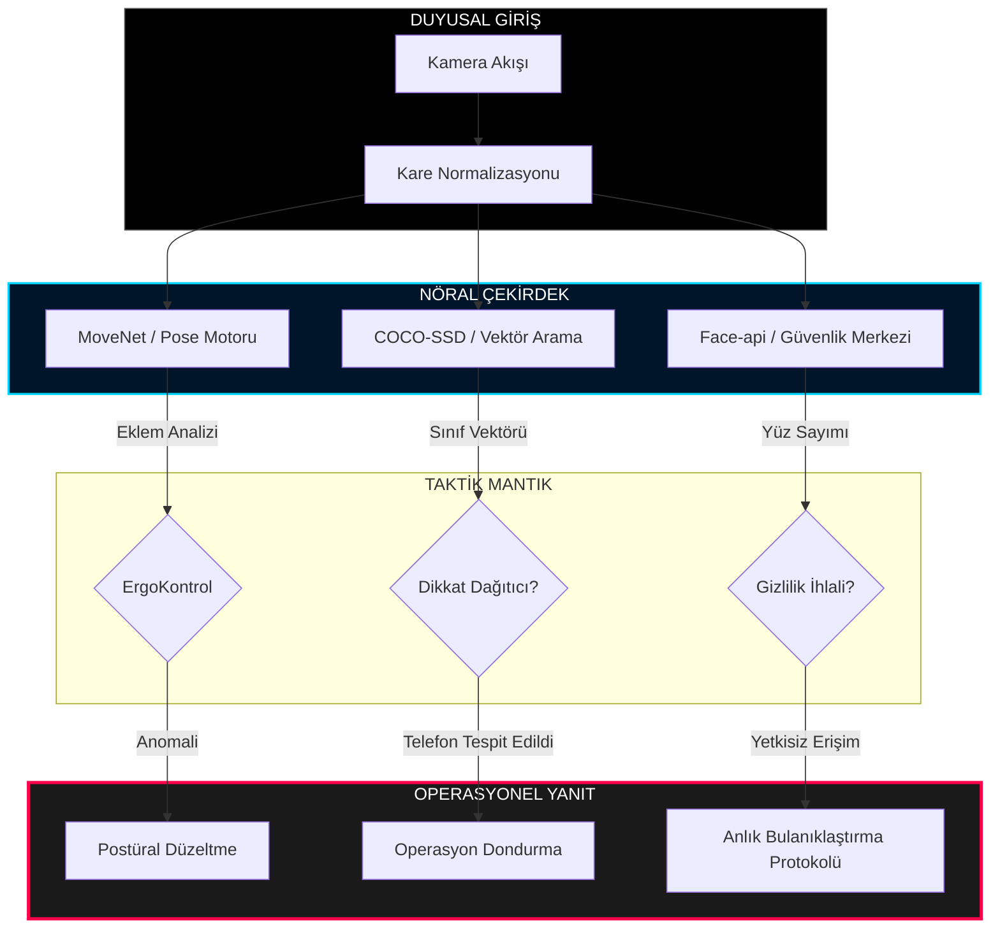

<div align="center">

# 🌌 SENTINEL_FOCUS // DERİN_ÇALIŞMA_KALESİ
### **[ TERMİNAL // SEVİYE_4_ERİŞİM_ONAYLANDI ]**

<br/>


<br/>

**SentinelFocus** sadece bir araç değil; bir dijital muhafızdır. Çalışma alanınızı güvence altına almak, duruşunuzu optimize etmek ve gizliliğinizi askeri düzeyde hassasiyetle savunmak için üst düzey **Kenar-YZ Görüntü İşleme** teknolojisini kullanır.

---

[ **⚡ KONSOLU ATEŞLE** ](#-operasyon-başlatma) | [ **🛡️ SAVUNMA PROTOKOLLERİ** ](#-güvenlik-protokolleri) | [ **🧠 NÖRAL HARİTA** ](#-nöral-sinyal-yolu) | [ **🛠️ TEKNİK ÖZELLİKLER** ](#-taktik-spesifikasyonlar)

---

</div>

## 🌐 SİSTEM MANİFESTOSU
> "Derin çalışmanın vakumunda, odak tek silahtır. Gizlilik ise tek kalkan." 
> 
> SentinelFocus, nöral mantığının %100'ünü yerel İşlemci/Grafik İşlemci sınırlarınız dahilinde yürütür. **Görüntü verisinin tek bir baytı bile buluta ulaşmaz.**

---

## 🖥️ OPS KOMUTA MERKEZİ

```text
┌──────────────────────────────────────────────────────────┐
│  SENTINEL_DASHBOARD v4.1 // TAKTİK_GENEL_BAKIŞ           │
├──────────────────────────────────────────────────────────┤
│  [ TARAYICI ] [ ANALİZ ]  [ KALKAN ]  [ OTURUM ]         │
│  ───────────  ────────────  ──────────  ───────────      │
│  CANLI_AKIS   60 FPS_SYNC   L4_AKTİF    02:45:12         │
│  DURUS_TAMAN  GOZ_SYNC_ACIK KİSİ: 0     VER: %98.4       │
└──────────────────────────────────────────────────────────┘
```

---

## 🧠 NÖRAL SİNYAL YOLU


---

## 🔒 GÜVENLİK PROTOKOLLERİ

> [!CAUTION]
> ### **P-01 // GİZLEME CİHAZI (THE CLOAKING DEVICE)**
> Nöral motor, gözetim vektöründe yetkisiz bir kişi veya ikincil bir yüz algıladığında, anında **L4 Arka Plan Bulanıklaştırmasını** tetikler. Tehdit temizlenene kadar ekranınız dijital bir sise dönüşür.

> [!IMPORTANT]
> ### **D-02 // DİKKAT DAĞITICI İMHA ANAHTARI**
> Birincil odak hunisine giren herhangi bir tanımlanmış mobil cihaz (`cell_phone`), aktif oturumu anında DURDURUR. Sentinel mutlak odaklanma talep eder.

---

## 🛠️ TAKTİK SPESİFİKASYONLAR

| KATEGORİ | ÖZELLİK | TOLERANS |
| :--- | :--- | :--- |
| **Kenar-YZ Motoru** | TensorFlow.js v4+ | < 15ms Gecikme |
| **İskelet Yapısı** | MoveNet Lightning L1 | Çift Omuz Vektörleme |
| **Gözetim** | COCO-SSD Üretim | 0.85 Güven Eşiği |
| **Arayüz** | Next.js // Tailwind CSS | 60 FPS Yenileme Hızı |
| **Şifreleme** | Yerel Depolama | AES-256 (Yerel İstatistikler) |

---

## 🚀 OPERASYON BAŞLATMA (KURULUM)

```bash
# 1. KALEYİ KLONLAYIN
git clone https://github.com/bahattinyunus/SentinelFocus.git

# 2. CEPHANELİĞİ HAZIRLAYIN
npm install --production

# 3. KOMUTA MERKEZİNİ ATEŞLEYİN
npm run dev
```

---

## 📈 GELİŞİM HARİTASI (ROADMAP)

- [x] **FAZ I:** Çekirdek Görüntü İşleme Motoru & Gizlilik Kalkanı
- [ ] **FAZ II:** Biyo-metrik Odak Senkronizasyonu (Kalp Atış Hızı Entegrasyonu)
- [ ] **FAZ III:** VS Code Taktik Komuta Merkezi
- [ ] **FAZ IV:** Nöral-Bağlantı Derin Odak Protokolü

---

<div align="center">

### **MUHAFIZ ASLA UYUMAZ.**
SentinelFocus, kişisel üretkenlik mühendisliğinde son sözdür.
[DİRENİŞE KATILIN](CONTRIBUTING.md) | [LİSANS_ANLAŞMASI](LICENSE.md)

</div>
